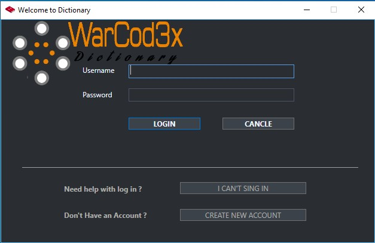

# WPF program for learning foreign words

### User Login

Username: Marko\
Password: 123123

### Login form (User can login or make a new account.)

### Registration form for new users

### There is also option for account recovery.

### Once a user has successfully logged in main window will be shown

##### Here we have couple of colums that may need explanation:

- WORD is a word on a foreign language
- DATE represents the date when the user entered the word
- TRANSLATED WORD is word on our language
- KNOWLEADGE OF WORD represents our knowledge of the word
- If we click on any of those words additional hiden rows will be shown for pronouncement and description

### Pressing dictionary button from a menu user can add new dictionary or remove/rename existing one

### Pressing word button from a menu user can add new words or delete

### User also can change any words from main manu like this:

### There is also option for Searching and Filtering words by dictionary

### Making Quiz Form

### Making & solving quiz and checking results after quiz is done. 

### The result of a previously performed test

### Packages are pre made dictionaries that contain hundreds of thousands of words. We can copy words from here to our dictionaries.

### User settings

### About this software

## License & Copyright

MIT License Copyright © 2020 Marko Samardzija

Permission is hereby granted, free of charge, to any person obtaining a copy
of this software and associated documentation files (the "Software"), to deal
in the Software without restriction, including without limitation the rights
to use, copy, modify, merge, publish, distribute, sublicense, and/or sell
copies of the Software, and to permit persons to whom the Software is
furnished to do so, subject to the following conditions:

The above copyright notice and this permission notice shall be included in all
copies or substantial portions of the Software.

THE SOFTWARE IS PROVIDED "AS IS", WITHOUT WARRANTY OF ANY KIND, EXPRESS OR
IMPLIED, INCLUDING BUT NOT LIMITED TO THE WARRANTIES OF MERCHANTABILITY,
FITNESS FOR A PARTICULAR PURPOSE AND NONINFRINGEMENT. IN NO EVENT SHALL THE
AUTHORS OR COPYRIGHT HOLDERS BE LIABLE FOR ANY CLAIM, DAMAGES OR OTHER
LIABILITY, WHETHER IN AN ACTION OF CONTRACT, TORT OR OTHERWISE, ARISING FROM,
OUT OF OR IN CONNECTION WITH THE SOFTWARE OR THE USE OR OTHER DEALINGS IN THE
SOFTWARE.
